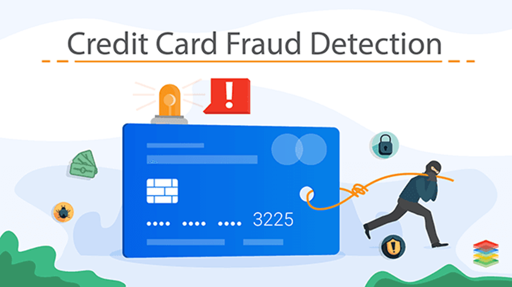
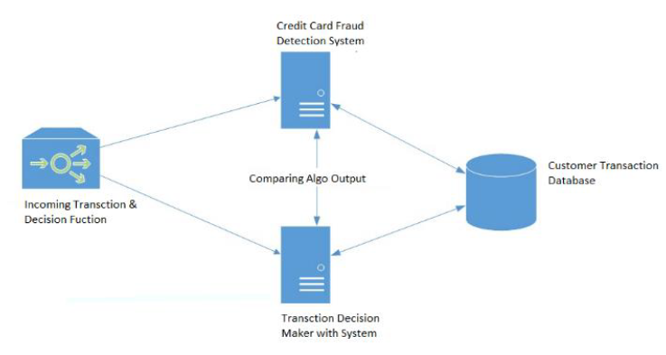
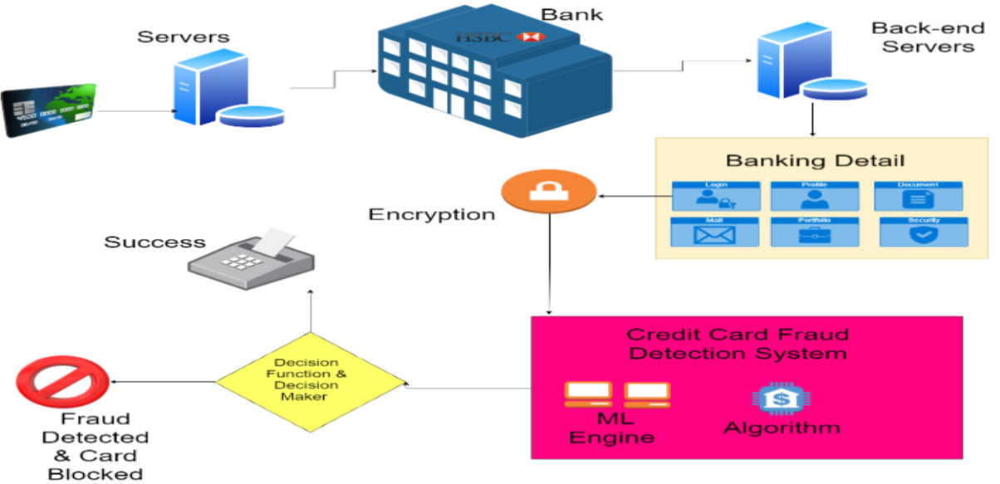

# Credit Card Fraud Detection

# INTRODUCTION

'Fraud' in credit card transactions is unauthorized and unwanted usage of an account by someone other than the owner of that account. Necessary prevention measures can be taken to stop this abuse and the behaviour of such fraudulent practices can be studied to minimize it and protect against similar occurrences in the future.
 
In other words, Credit Card Fraud can be defined as a case where a person uses someone else’s credit card for personal reasons while the owner and the card issuing authorities are unaware of the fact that the card is being used.
 
Fraud detection involves monitoring the activities of populations of users in order to estimate, perceive or avoid objectionable behaviour, which consist of fraud, intrusion, and defaulting.
 
This is a very relevant problem that demands the attention of
communities such as machine learning and data science where
the solution to this problem can be automated.

## METHODOLOGY:

The approach that this paper proposes, uses the latest machine learning algorithms to detect anomalous activities, called
outliers.
 
The basic rough architecture diagram can be represented with the following figure:

When looked at in detail on a larger scale along with real life elements, the full architecture diagram can be represented as follows :

##  Main challenges involved in credit card fraud detection are:
1. Enormous Data is processed every day and the model build must be fast enough to respond to the scam in  time.
2. Imbalanced Data i.e most of the transactions (99.8%) are not fraudulent which makes it really hard for detecting the fraudulent ones.
3. Data availability as the data is mostly private.
4. Misclassified Data can be another major issue, as not every fraudulent transaction is caught and reported.
5. Adaptive techniques used against the model by the scammers.

## How to tackle these challenges?
1. The model used must be simple and fast enough to detect the anomaly and classify it as a fraudulent transaction as quickly as possible.
2. Imbalance can be dealt with by properly using some methods which we will talk about in the next paragraph
3. For protecting the privacy of the user the dimensionality of the data can be reduced.
4. A more trustworthy source must be taken which double-check the data, at least for training the model.
5. We can make the model simple and interpretable so that when the scammer adapts to it with just some tweaks we can have a new model up and running to deploy.

## Data Collection:
Credit Card Fraud Detection
Anonymized credit card transactions labeled as fraudulent or genuine (From kaggle.com)
https://www.kaggle.com/datasets/mlg-ulb/creditcardfraud

## About Dataset

The dataset contains transactions made by credit cards in September 2013 by European cardholders.

 
This dataset presents transactions that occurred in two days, where we have 492 frauds out of 284,807 transactions. The dataset is highly unbalanced, the positive class (frauds) account for 0.172% of all transactions

 
It contains only numerical input variables which are the result of a PCA transformation. Unfortunately, due to confidentiality issues, we cannot provide the original features and more background information about the data. Features V1, V2, … V28 are the principal components obtained with PCA, the only features which have not been transformed with PCA are 'Time' and 'Amount'. Feature 'Time' contains the seconds elapsed between each transaction and the first transaction in the dataset. The feature 'Amount' is the transaction Amount, this feature can be used for example-dependant cost-sensitive learning. Feature 'Class' is the response variable and it takes value 1 in case of fraud and 0 otherwise.
 
Given the class imbalance ratio, we recommend measuring the accuracy using the Area Under the Precision-Recall Curve (AUPRC). Confusion matrix accuracy is not meaningful for unbalanced classification.

